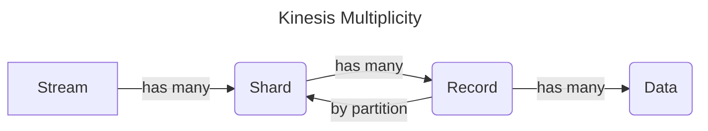

# Learning Terraform 

Using a this hello world [tutorial](https://youtu.be/SLB_c_ayRMo). Let's create a public facing webserver.

## Setup for new machine

- [x] ubuntu wsl2 (sorry, I'm on Windows)
- [x] git
- [x] ohmyzsh with plugins
  - [x] git
  - [x] aws
  - [x] terraform
  - [x] fzf
  - [x] zsh-completions
  - [x] zsh-autosuggestions
- [x] aws cli
- [x] vscode extensions
- [x] terraform
- [x] jq

Next step: [HashiCorp Terraform Associate Certification Course](https://youtu.be/V4waklkBC38).

## AWS Kinesis

Fully managed resource for data streaming.

## AWS Kinesis Firehose 

Easiest way to load a data stream into a data store or analytic tool like S3, Redshift, Elasticsearch, Splunk, dashboards, etc. A fully managed service that auto scales. It can batch, compress, encrypt data all before loading it to minimize storage. 
